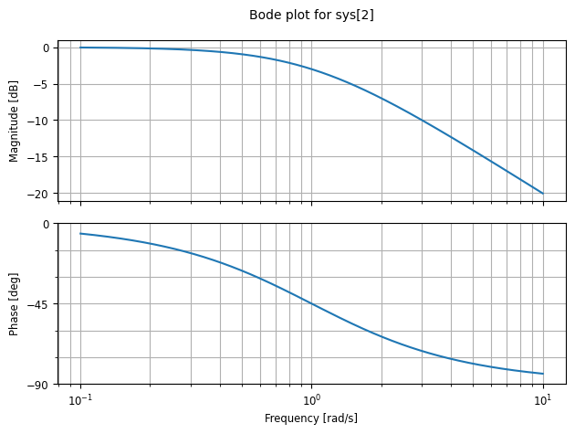

# Bode plots using python

Using python **Control** library  to visualise transfer function.
This minimises time spend on drawing bode plots by hand.

The Python Control Systems Library (python-control) is a Python package that implements basic operations for analysis and design of feedback control systems.

# installation

```
  pip install control
```

[Github repository ](https://github.com/ODARI-CHARLES1/BodeplotTutorial)

## Contact me:

 Email: odari.charles23@students.dkut.ac.ke

 Portifolio: [odariportifolio](https://odari-portifolio.vercel.app/)

## Low pass filter bode plot -bilinear

]
